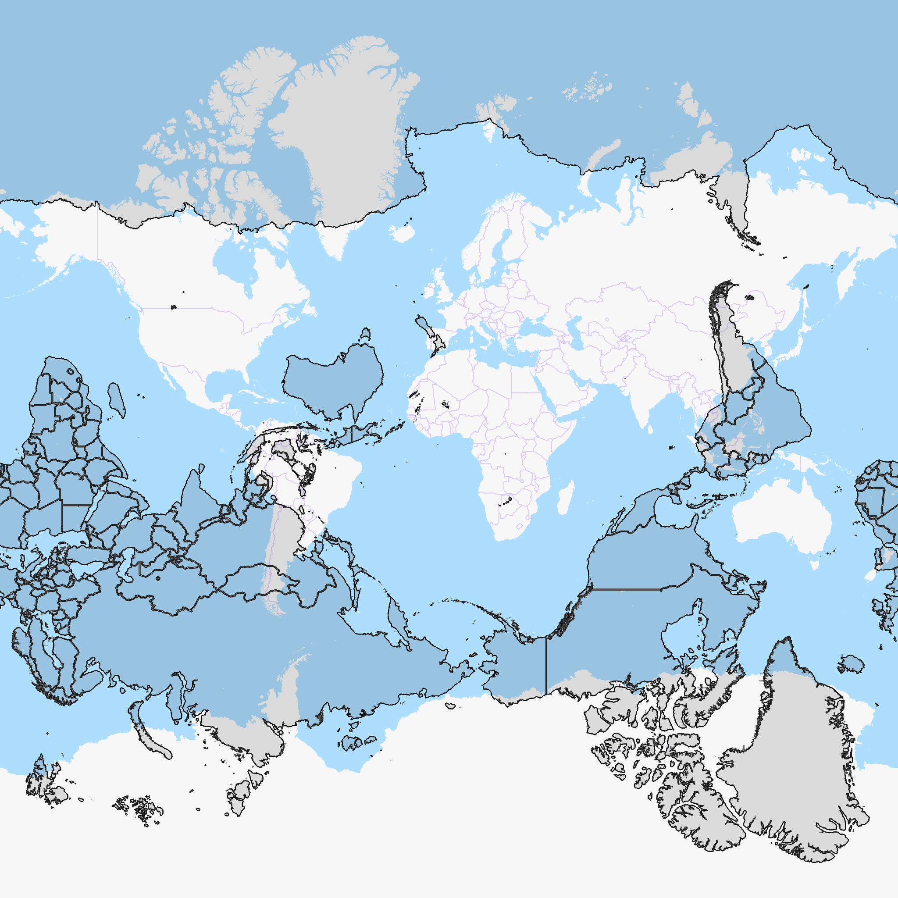

# What is my furthest point on Earth?
Have you ever wondering if you were to dig straight down through the center of the earth and come out to the other side, where would you end up? Well, I have, and I found out that it would be the furthest point on the planet. It's obvious, isn't it?

For example, If you dig straight down in Singapore, you'd come out around the east part of Ecuador. The calculation is really simple. First, you need to get the [geodetic coordinates](https://en.wikipedia.org/wiki/Geodetic_coordinates) latitude and longitude of the location you want. To find the furthest point, you negate the sign of the latitude, and for the longitude, if it's negative you add 180 but if it's positive you subtract 180.

From our Singapore example, We'll use OpenStreetMap to get the coordinates. https://www.openstreetmap.org/#map=8/1.335/103.843 from the URL, we get 1.335 is our latitude and 103.843 is our longitude (8 is the zoom level). After the calculation, we get latitude = 1.335 * **-1** = -1.335 and longitude = 103.843 **- 180** = -76.157. Replace the coordinates back in the URL https://www.openstreetmap.org/#map=8/-1.335/-76.157. If you open the link, you'll see that the center of the map is the furthest point from Singapore, which is happened to be in Ecuador. Cool, right?

Since most of our planet surface is water, then I wanted to know how much area of the planet that has land on both ends. After fiddling around with math and map, I've arrived to the following image.

The image shows an overlay of two maps, the normal map in white and blue, and the furthest area represents in transparent black with hard edges.

I've heard some Americans say that if they dig straight down, they'd come out in China. Well, they wouldn't If they dig through the center of the earth. Instead, they'd come out somewhere in the ocean south of India, according to the above image.

Alright!, that's it people, that's all I've got for now. And here for the bonus, I've made a simple interactive [web app](https://theyoke.github.io/blog/what-is-my-furthest-point-on-earth/map.html). If you click on the map, the cursor will point to the furthest point on the map according to where you clicked.

Thanks for reading -- Nathan Young (23 November 2021)
